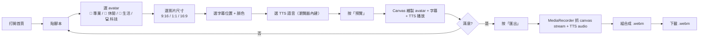

# ugc-video-generator · PRD v3.0.2 等級規格書

> 自動生成：2026-09-06（Sean 10-repo-fleet Batch 7C）
> 對齊 SPEC v3.0 契約（SPEC §1–§19 全部套用）
> 前置：v2.0 純前端 MVP pivot（2026-07-10）

---

## 1. 產品概述

### 1.1 問題陳述
UGC（User Generated Content）短影片創作者面對**雙重摩擦**：
1. 想做 AI 主播 / 虛擬人講解，但**任何方案都要 API key**（HeyGen / D-ID / Synthesia 月費 NT$1,500+）
2. 就算有 API key，後端部署常因單一服務失敗而整個卡死

本工具砍掉這兩層摩擦——純瀏覽器、零 API key、零後端。**打開網頁、貼稿、選 avatar、選尺寸、3 步拿到 .webm 短影片**。

### 1.2 目標使用者
| Persona | 工作情境 | 主要任務 |
|---|---|---|
| Primary · 阿明（YouTube Shorts 創作者）| 週 5 支，要 AI 主播講解 | 貼稿 → 選 9:16 → 選科技 avatar → 輸出 |
| Secondary · Linda（IG Reels 編輯）| 日 2-3 支，要快速品牌 | 選 1:1 → 選專業 avatar → 加字幕 |
| Tertiary · 浩子（podcast 推廣小編）| 偶爾做預告 | 選休閒 avatar → 加亮黃字幕 → 輸出 |

### 1.3 核心價值主張
> **「零 API key、純瀏覽器 — 貼稿 + 選 avatar + 選尺寸，3 步出 .webm 短影片。」**

### 1.4 Non-Goals（明確不做）
- ❌ 真實 AI 虛擬人（HeyGen / D-ID 紅海）
- ❌ 雲端後端帳號 / 訂閱
- ❌ 影音剪輯 / 多軌混音（CapCut 紅海）
- ❌ AI 圖像生成（SDXL / Midjourney 紅海）
- ❌ 多語言字幕（v1 繁中 only）
- ❌ 多人協作 / 後台
- ❌ 排程 / 自動發布（Buffer / Later 紅海）

---

## 2. 使用者場景與流程

### 2.1 使用者流程圖



### 2.2 主要場景

| 場景 | 輸入 | 輸出 | 成功條件 |
|---|---|---|---|
| 1. 貼稿→選 avatar | 腳本 + 4 種 avatar | 預覽畫面 | Canvas 繪製 gradient + emoji + 字幕 |
| 2. 切換尺寸 | 9:16 / 1:1 / 16:9 | Canvas 重新調整 | 比例正確、可即時預覽 |
| 3. 切換字幕 | 位置 + 4 種顏色 | 字幕重新渲染 | 即時更新 Canvas |
| 4. 播放預覽 | (點預覽) | TTS 講稿 + 字幕動態 | 繁中 zh-TW voice |
| 5. 匯出 .webm | (點匯出) | .webm 檔 | vp9 + opus、可在瀏覽器 / VLC 播 |

---

## 3. 功能需求

| FR | 名稱 | 優先級 | 狀態 |
|---|---|---|---|
| FR-001 | 腳本輸入（textarea）| P0 | ✅ shipped |
| FR-002 | 4 種 avatar 預設（專業 / 休閒 / 生活 / 科技）| P0 | ✅ shipped |
| FR-003 | 3 種影片尺寸（9:16 / 1:1 / 16:9）| P0 | ✅ shipped |
| FR-004 | 4 種字幕顏色 | P0 | ✅ shipped |
| FR-005 | 字幕位置切換（top / center / bottom）| P0 | ✅ shipped |
| FR-006 | Canvas 即時預覽（gradient + emoji + 字幕）| P0 | ✅ shipped |
| FR-007 | TTS 旁白（speechSynthesis，zh-TW）| P0 | ✅ shipped |
| FR-008 | WebM 匯出（vp9 + opus）| P0 | ✅ shipped |
| FR-009 | 純前端、零 API key、零後端 | P0 | ✅ shipped |
| FR-010 | Tailwind v4 風格（簡潔 + 印刷感）| P1 | ✅ shipped |
| FR-011 | 匯出時長估算（依字數 + 1s padding）| P1 | ✅ shipped |
| FR-012 | SSR 安全的 `useEffect` 初始化 | P0 | ✅ shipped |
| FR-013 | GHA CI 4-job workflow | P1 | ✅ shipped (v3.0.2) |
| FR-014 | PRD v3.0.2 規格書 + CHANGELOG | P1 | ✅ shipped (v3.0.2) |
| FR-015 | 單元測試（vitest，format dims + persona + recorder）| P1 | ⏳ planned |
| FR-016 | 上傳客製 avatar 圖片 | P2 | ⏳ planned |
| FR-017 | 字幕時間軸分段 | P2 | ⏳ planned |
| FR-018 | MP4 匯出（ffmpeg.wasm）| P2 | ⏳ planned |
| FR-019 | 多語言字幕（英 / 日 / 韓）| P2 | ⏳ planned |
| FR-020 | PWA / 離線可匯出 | P2 | ⏳ planned |

---

## 4. Non-Functional Requirements

| 維度 | 需求 |
|---|---|
| Performance | 啟動 < 1.5s；WebM 渲染 = 腳本時長；Canvas 重繪 < 16ms |
| Security | 無後端、零資料外洩；腳本不離開瀏覽器 |
| Privacy | 零 telemetry、零 analytics |
| Accessibility | WCAG 2.1 AA（按鈕 aria-label、字幕對比 ≥ 4.5:1）|
| Browser | Modern evergreen（必須支援 MediaRecorder + canvas.captureStream）|
| Responsive | 桌機優先；行動 ≥ 360px 可閱讀、不主打手機操作 |
| Build | Next.js 16 + Turbopack |
| Codec | 預設 vp9 + opus（fallback vp8）|

---

## 5. 技術架構

```
ugc-video-generator (Next.js 16 App Router)
├── app/
│   ├── page.tsx                 # 主 UI（腳本 / avatar / 尺寸 / 字幕 / 預覽 / 匯出）
│   ├── layout.tsx               # root layout
│   ├── globals.css              # Tailwind v4
│   ├── components/
│   │   ├── PreviewCanvas.tsx    # Canvas 即時繪製
│   │   └── VideoExporter.tsx    # MediaRecorder 邏輯封裝
│   └── lib/
│       ├── types.ts             # Avatar / Format / Subtitle 等 enum + 對照表
│       └── videoRecorder.ts     # WebmRecorder class + speak() helper
├── PRD/
│   ├── SPEC.md
│   └── CHANGELOG.md
├── .github/workflows/ci.yml
├── next.config.ts               # App Router + Turbopack
├── tsconfig.json
├── tailwind / postcss
└── vercel.json                  # framework: nextjs
```

### 5.1 Module Map
- `app/` — 主要程式碼（單一頁面 + 2 個 components + 2 個 lib）
- `tests/` — 單元測試（v3.0.2 之後可加）
- `.next/` — 構建產物（gitignore）
- `.github/workflows/` — CI/CD

### 5.2 環境變數
- 無（純前端 / 零 API key）

### 5.3 降級策略
- MediaRecorder 不支援 vp9 → fallback vp8
- 瀏覽器無 TTS voice → 仍可預覽 canvas 字幕、匯出無聲
- Canvas 不可用 → 顯示「請使用現代瀏覽器」

---

## 6. Definition of Done

- [x] FR P0 全部實作（FR-001 ~ FR-009）
- [x] `npm run build` 綠
- [x] `npm run lint` 0 error
- [x] GHA CI 4-job workflow（lint / test / build / deploy to Vercel）
- [x] README 反映現況
- [x] PRD/SPEC.md v3.0.2 等級規格書
- [x] PRD/CHANGELOG.md 含 v3.0.2 條目
- [x] Vercel deploy 設定完成（vercel.json: framework: nextjs）
- [x] 純前端、零 API key、零後端
- [x] 零 telemetry、零資料外洩

---

## 7. 部署契約

| 環境 | 目標 | 觸發 |
|---|---|---|
| Production | Vercel | push to main |
| Preview | Per-PR（Vercel 自動）| PR opened |

### 7.1 GHA Workflow
- `.github/workflows/ci.yml`
- jobs: lint / test / build / deploy
- deploy: **Vercel**（Vercel Hobby 平台已掛 GitHub auto-deploy；GHA deploy 為輔助）

### 7.2 環境變數
- 無需 server-side secret
- 無 BYOK

---

## 8. Out of Scope（不做的）

- ❌ 帳號系統（永遠不做）
- ❌ 付費牆（永遠不做）
- ❌ 原生 App
- ❌ 多語系字幕（v1 繁中 only）
- ❌ 排程 / 自動發布
- ❌ 多人協作 / 後台
- ❌ 真實 AI 虛擬人像（HeyGen / D-ID 紅海）

---

## 9. 變更日誌

見 [`PRD/CHANGELOG.md`](PRD/CHANGELOG.md)
