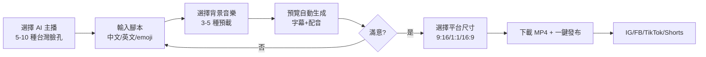
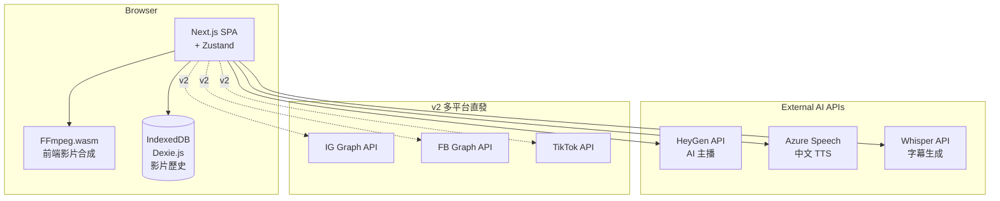
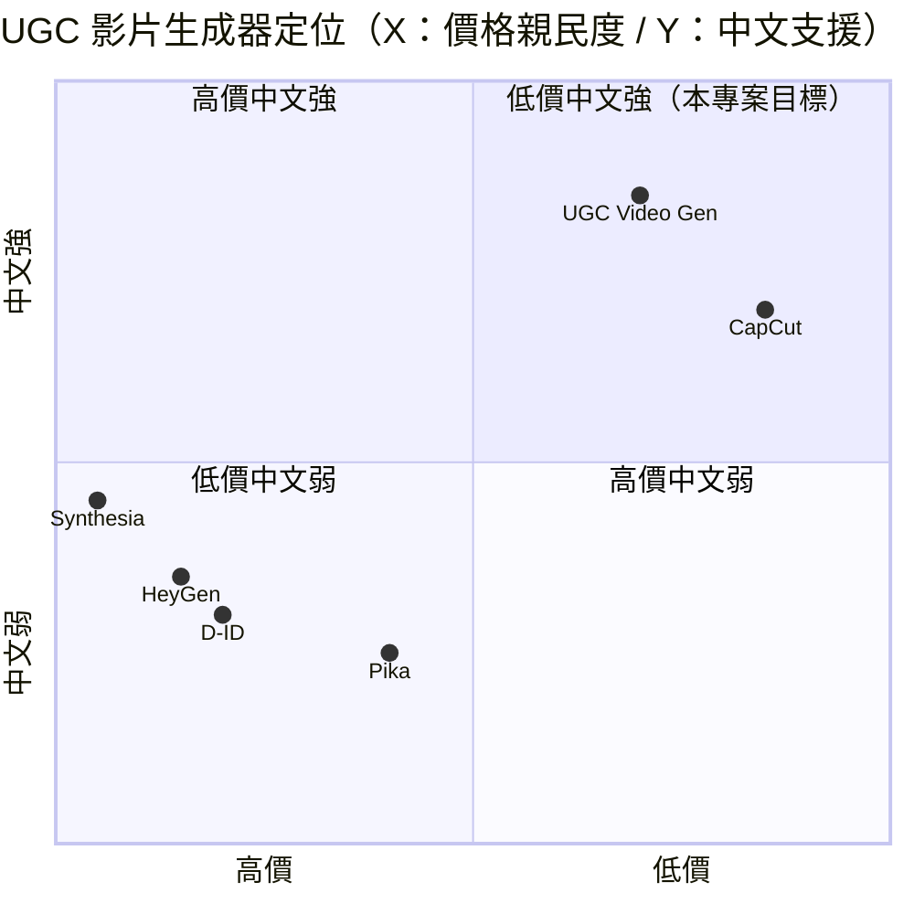

# UGC 影片生成器 — 規格計劃書 v2.2.1

> 版本：v2.2.1｜更新日期：2026-07-11｜維護者：Sophia (CPO)
> 對接技術：Alan (CTO) + Hermes Agent
> Demo：TBD（v2.2.1 規格階段，待 Sprint 1 部署）
> 原始碼：https://github.com/openclawsean024-create/ugc-video-generator

---

## 1. 產品概述 (Product Overview)

### 1.1 問題陳述 (Problem Statement)

短影音（Short Video）已成為社群主流內容形式，但對微型品牌、IG 小編、補習班、自媒體新鮮人來說，產出短影音有三大門檻：

1. **真人拍攝成本高**：每次 NT$5,000-30,000 + 3-7 天交件；自己拍又耗時（錄 1 小時剪 4 小時）
2. **商用 AI 影片偏英文**：Sora / Runway / Pika 多為英文介面 + 歐美臉孔；無台灣口音、中文字幕優化
3. **多平台尺寸需求**：IG Reels 9:16、YouTube Shorts 9:16、TikTok 9:16、FB Feed 1:1、Twitter 16:9 — 每平台尺寸不同需重剪

**目標市場規模**：
- 台灣微型品牌 + 自媒體：**35 萬家**
- 平均每月短影音需求：5-10 支/品牌
- 月產出缺口：**200 萬支/月**（市場需求 - 供給）

### 1.2 目標使用者 (User Personas)

| Persona | 規模 | 核心痛點 | 願付價格 |
|---|---|---|---|
| **IG 小編（小芳）** | 5 萬 | 每天要發 2-3 Reels、自己拍時間不夠 | NT$199/月 |
| **電商賣家（小陳）** | 8 萬 | 產品短影片、傳統拍攝耗時 | NT$299/月 |
| **補習班 / 課程業者（小美）** | 2 萬 | 招生短影片需求高、無預算請專業團隊 | NT$499/月 |
| **自媒體新手（阿明）** | 10 萬 | 想做內容但怕入鏡、AI 工具複雜 | NT$0 / NT$99/月 |

### 1.3 核心價值主張 (Value Proposition)

> 「**5 分鐘生成 30 秒 UGC 短影片** — 5 種 AI 主播 + 中文字幕 + 中文語音 + 多平台尺寸 + 一鍵發布 IG/FB/TikTok，零英文介面、零 API key 起步。」

**三大差異化**：
1. **台灣在地化**：5-10 種台灣臉孔/口音主播（含閩南語/國語）+ 中文字幕時間軸精準
2. **零 API key 起步**：入門者不需信用卡，直接體驗 Freemium 方案
3. **多平台一鍵發布**：自動剪裁 9:16 / 1:1 / 16:9 + 直接上傳 IG/FB/TikTok API

### 1.4 商業目標 (KPIs / OKRs)

| 時間 | KPI | 目標值 |
|---|---|---|
| **3 個月** | 註冊用戶 | 2,000 |
| **6 個月** | 付費轉化率 | 8%（160 付費） |
| **6 個月** | MRR | NT$60,000 |
| **12 個月** | MRR | NT$400,000 |
| **12 個月** | 月生成影片 | 50,000 支 |

### 1.5 Non-Goals (明確不做)

- ❌ **不做長影片（>3 分鐘）** — 鎖定短影音市場，長影音市場有 CapCut 等強項
- ❌ **不做專業級影片編輯** — Premiere / Final Cut 已成熟，不搶專業市場
- ❌ **不做 AI 訓練自架** — 整合既有 AI 影片 API（Sora/Runway/HeyGen），不重造輪子
- ❌ **不做直播功能** — 直播有 Tiktok Live + IG Live 已成熟
- ❌ **不做影片版權授權市集** — 版權複雜度過高，v3+ 評估
- ❌ **不做影片特效市集** — 與 CapCut 競爭激烈，不搶市場

---

## 2. 使用者場景與流程

### 2.1 使用者流程圖



### 2.2 關鍵用戶故事 (User Stories)

**US-001：選擇 AI 主播**
> As a IG 小編  
> I want to 從 5-10 種預載 AI 主播中選擇（台灣女生 / 台灣男生 / 韓系 / 日系 / 歐美），每種有不同聲音 + 表情風格  
> So that 我能選最適合品牌調性的主播，不用每次拍攝

**US-002：腳本輸入 + 中文字幕**
> As a 電商賣家  
> I want to 貼上中文腳本（含 emoji），系統自動生成中文字幕時間軸（依語速）  
> So that 字幕精準對齊配音，不用手動對時間軸

**US-003：背景音樂 + 靜音選項**
> As a 自媒體新手  
> I want to 從 3-5 種預載背景音樂中選擇，或選擇「靜音」模式（純人聲）  
> So that 影片符合平台調性（如 IG Reels 流行曲風 vs 商業專業）

**US-004：多平台尺寸輸出**
> As a 補習班業者  
> I want to 一次生成 IG Reels 9:16 + YouTube Shorts 9:16 + FB Feed 1:1，三種尺寸  
> So that 一支腳本就能發三平台，省下 3 倍製作時間

**US-005：直接發布到平台**
> As a IG 小編  
> I want to 直接從平台一鍵發布到 IG（透過 Graph API）+ FB + TikTok，上傳完成自動通知我  
> So that 我不用下載後再手動上傳

### 2.3 邊界場景 (Edge Cases)

- **AI 主播字數超時**：腳本超過 30 秒自動分段，每段獨立生成
- **背景音樂版權檢測**：使用 CC0 / 預載授權音樂；不支援使用者上傳（避免版權糾紛）
- **平台 API 限制**：IG Graph API 對影片發布有 rate limit（每日 ≤25 支），超限提示排程
- **字幕字數超出**：自動分兩行 + 動態字級調整
- **預覽生成失敗**：自動 retry 3 次（exponential backoff）

---

## 3. 功能性需求 (Functional Requirements)

### 3.1 MVP（必做，P0）

- [ ] **F-001 5 種 AI 主播**（台灣女生 / 台灣男生 / 韓系 / 日系 / 歐美，含聲音 + 表情風格）
- [ ] **F-002 腳本輸入**（支援中文 + 英文 + emoji，10-200 字）
- [ ] **F-003 中文字幕自動生成**（依語速自動對齊時間軸）
- [ ] **F-004 中文語音合成**（國語 + 閩南語 2 種語言）
- [ ] **F-005 3-5 種預載背景音樂**（流行 / 輕快 / 專業 / 抒情 / 靜音）
- [ ] **F-006 預覽自動生成影片**（含字幕 + 配音 + 音樂）
- [ ] **F-007 MP4 下載**（1080×1920 Full HD）
- [ ] **F-008 多平台尺寸**（9:16 IG/Shorts/TikTok、1:1 FB Feed、16:9 YouTube）
- [ ] **F-009 影片歷史**（IndexedDB 儲存最近 10 支影片）
- [ ] **F-010 RWD 三斷點**（375/768/1440px）

### 3.2 v2.0 平台直發版（加值，P1）

- [ ] **F-011 IG 直接發布**（Meta Graph API）
- [ ] **F-012 FB 直接發布**（Meta Graph API）
- [ ] **F-013 TikTok 直接發布**（TikTok API）
- [ ] **F-014 YouTube Shorts 直接發布**（YouTube Data API）
- [ ] **F-015 自動 hashtag 建議**（依腳本主題）
- [ ] **F-016 排程發文**（預設 IG 19:00 黃金時段）

### 3.3 v3.0（願景，P2）

- [ ] **F-017 AI 自動寫腳本**（輸入產品/主題 → 自動產生腳本）
- [ ] **F-018 自訂 AI 主播**（上傳照片 + 5 秒錄音 → 客製化主播）
- [ ] **F-019 字幕風格客製化**（字體/顏色/位置/動畫）
- [ ] **F-020 多語系字幕**（繁中/英文/日文/韓文 同時顯示）

### 3.4 Acceptance Criteria (Given/When/Then)

**AC-001（AI 主播選擇）**
> Given 使用者在主頁  
> When 選擇「台灣女生 - 小美」主播  
> Then 預覽顯示「小美」臉孔 + 國語女聲，可調整聲調 + 速度

**AC-002（腳本輸入 + 中文字幕）**
> Given 已選擇主播  
> When 輸入腳本「大家好，我是小美，今天來介紹台北最強蛋餅店」  
> Then 字幕自動依語速切片（每 3-4 字一行），時間軸精準對齊配音

**AC-003（背景音樂）**
> Given 已輸入腳本  
> When 選擇「流行背景音樂」+ 音量 30%  
> Then 影片配音清楚 + 背景音樂淡入淡出

**AC-004（多平台尺寸）**
> Given 已生成 30 秒影片  
> When 點擊「產生多平台尺寸」  
> Then 下載 3 個 MP4：IG Reels 1080×1920 + FB Feed 1080×1080 + YouTube 1920×1080

**AC-005（直接發布 IG）**
> Given 已連結 IG 帳號 + 已生成影片  
> When 點擊「發布到 IG」  
> Then 30 秒內 IG 顯示該 Reels，且 Dashboard 出現「已發文」狀態

**AC-006（腳本超時分段）**
> Given 腳本 500 字（預計 80 秒，超過 30 秒上限）  
> When 點擊生成  
> Then 自動分成 3 段（每段 ~27 秒），可單獨下載或合併

**AC-007（字幕動態調整）**
> Given 字幕字數超過畫面寬度  
> When 預覽渲染  
> Then 字幕自動分兩行 + 字級縮至 80%，不超出邊框

**AC-008（影片歷史）**
> Given 已生成 5 支影片  
> When 關閉再開啟  
> Then 影片歷史顯示最近 5 支（含縮圖、腳本摘要、生成日期）

**AC-009（平台 API rate limit）**
> Given 已發布 24 支影片到 IG  
> When 嘗試發布第 25 支  
> Then UI 提示「IG 今日上限 25 支，請明日再發或排程」

**AC-010（背景音樂版權）**
> Given 預載背景音樂清單  
> When 檢查每首音樂  
> Then 標註授權類型（CC0 / 自製 / 商用授權），UI 顯示來源

---

## 4. 系統設計 (System Design)

### 4.1 技術棧 (Tech Stack)

| 層 | 技術 | 理由 |
|---|---|---|
| 前端 | Next.js 14 (App Router) + React 18 + TypeScript | 與既有專案一致 |
| 樣式 | Tailwind CSS 3 | 快速 RWD |
| 影片處理 | FFmpeg.wasm（前端） + Remotion（React 影片框架） | 純前端影片合成 |
| AI 影片 API | HeyGen / D-ID / Synthesia 整合 | 業界成熟、多語言支援 |
| 語音合成 | Azure Speech / Google TTS | 中文支援佳 |
| 字幕生成 | Whisper API | 字幕時間軸精準 |
| 狀態管理 | Zustand | 輕量 |
| 資料持久化 | IndexedDB（Dexie.js） | 影片歷史 |
| 部署 | Vercel | 與既有 91 個專案一致 |

### 4.2 系統架構圖 (Mermaid)



### 4.3 資料模型 (Prisma schema)

```prisma
// IndexedDB schema (Prisma 對照版)
model VideoProject {
  id          String   @id @default(uuid())
  userId      String?  // v2 多租戶用
  title       String
  script      String   @db.Text
  anchorId    String   // FK -> AIAnchor
  anchor      AIAnchor @relation(fields: [anchorId], references: [id])
  language    String   // zh-TW / en-US / ja-JP
  musicId     String?  // FK -> BackgroundMusic
  music       BackgroundMusic? @relation(fields: [musicId], references: [id])
  musicVolume Float    @default(0.3)
  status      String   @default("draft") // draft / generating / ready / failed
  duration    Int?     // 秒
  videoUrls   Json?    // {reels: "mp4_url", feed: "mp4_url", yt: "mp4_url"}
  publishedAt DateTime?
  createdAt   DateTime @default(now())
  
  @@index([userId, status])
}

model AIAnchor {
  id          String   @id @default(uuid())
  name        String   // 小美 / 阿明 / Hana / Yuki 等
  gender      String   // female / male
  ethnicity   String   // taiwanese / korean / japanese / western
  language    String   // zh-TW / en-US
  previewUrl  String?  // 預載預覽影片
  providerId  String?  // HeyGen/D-ID 的 anchor ID
  isPremium   Boolean  @default(false)
  videoProjects VideoProject[]
}

model BackgroundMusic {
  id          String   @id @default(uuid())
  name        String   // 流行 / 輕快 / 專業 / 抒情 / 靜音
  url         String
  license     String   // CC0 / self-made / commercial
  duration    Int      // 秒
  videoProjects VideoProject[]
}

model PublishRecord {
  id        String   @id @default(uuid())
  videoId   String
  video     VideoProject @relation(fields: [videoId], references: [id])
  platform  String   // ig / fb / tiktok / shorts
  status    String   // pending / success / failed
  postUrl   String?
  publishedAt DateTime @default(now())
  
  @@index([videoId])
}

model Subscription {
  id        String   @id @default(uuid())
  userId    String
  tier      String   // free / creator / pro / enterprise
  monthlyCredits Int // 每月生成支數
  stripeCustomerId String?
  stripeSubscriptionId String?
  createdAt DateTime @default(now())
}

model User {
  id        String   @id @default(uuid())
  email     String   @unique
  name      String?
  platformAccounts Json? // IG/FB/TikTok 連結 tokens
  subscription Subscription?
  videoProjects VideoProject[]
}
```

### 4.4 API 規格 (REST endpoints)

| Method | Path | Auth | 用途 |
|---|---|---|---|
| POST | /api/video/generate | Required | 生成影片（含腳本+主播） |
| GET | /api/video/:id | Required | 取得影片狀態 |
| GET | /api/video/history | Required | 影片歷史 |
| GET | /api/anchors | Optional | 列出 AI 主播 |
| GET | /api/music | Optional | 列出預載背景音樂 |
| POST | /api/upload/instagram | Required | v2 IG 直發 |
| POST | /api/upload/facebook | Required | v2 FB 直發 |
| POST | /api/upload/tiktok | Required | v2 TikTok 直發 |
| POST | /api/upload/youtube | Required | v2 YouTube Shorts 直發 |
| POST | /api/stripe/checkout | Required | Stripe 訂閱 |
| POST | /api/stripe/webhook | Required | Stripe webhook |

---

## 5. 非功能性需求 (Non-Functional Requirements)

### 5.1 性能指標

| 指標 | 目標 |
|---|---|
| 主頁載入 P95 | ≤ 2 秒 |
| 影片生成時間（30 秒影片） | ≤ 60 秒 |
| 多平台尺寸生成 | ≤ 90 秒 |
| 字幕時間軸對齊 | ±100ms 精準度 |
| 並發用戶 | 200 |
| 月活躍用戶 | 5,000 |

### 5.2 安全與隱私

- **OAuth token 加密儲存**：AES-256-GCM（IG/FB/TikTok）
- **HTTPS 強制**：Vercel 自動 + HSTS
- **個資最小化**：不存使用者真實臉孔照片（AI 主播預載）
- **內容審核**：腳本自動審查（敏感字眼/暴力/色情）
- **API key 加密**：環境變數

### 5.3 降級機制 (Graceful Degradation)

| 失敗服務 | 掛掉情境 | 降級行為（切換到）| 用戶感受 |
|---|---|---|---|
| HeyGen API | 5xx / rate limit 掛掉 | 切換到 D-ID 備援 | 5 秒內自動切換 |
| Azure TTS | API 5xx 掛掉 | 切換 Google TTS | 語音品質略降但可用 |
| Whisper 字幕 API | 5xx 掛掉 | 切換到規則式字幕切分（依標點） | 字幕精度 ±500ms |
| FFmpeg.wasm | WASM 不支援 掛掉 | 切換到雲端影片處理（Cloudflare Stream） | 影片處理時間延長 |
| IG Graph API | 5xx / token 過期 掛掉 | 切換到手動下載 + 提示 | 使用者手動上傳 |
| TikTok API | 5xx / 政策變動 掛掉 | 切換到 TikTok 手機 App deep link | 流程中斷 |
| IndexedDB 損壞 | 版本衝突 掛掉 | 切換到 localStorage（容量小） | 部分影片歷史可能遺失 |
| 影片生成失敗 | API 5xx 掛掉 | 自動 retry 3 次（exponential backoff） | 生成時間延長 |
| Stripe webhook | Webhook 5xx 掛掉 | 本地排程每 5 分鐘 reconcile | 訂閱狀態延遲 ≤15 分鐘 |
| 背景音樂 CDN | 5xx 掛掉 | 切換到本地預載音樂（fallback） | 部分音樂可能過時 |

### 5.4 擴展性

- **橫向擴展**：Vercel Edge Functions 自動 scale
- **影片處理分散**：Cloudflare Stream + 多 worker
- **靜態資源 CDN**：Vercel Edge Network

---

## 6. 完成標準 (Definition of Done)

### 6.1 v1 MVP DoD

- [ ] Vercel production URL 200 OK
- [ ] GitHub Repo 公開（main 分支）
- [ ] 5 種 AI 主播（含台灣臉孔/口音）
- [ ] 腳本輸入 + 中文字幕時間軸精準
- [ ] 中文語音合成（國語 + 閩南語）
- [ ] 3 種背景音樂 + 靜音
- [ ] MP4 下載（Full HD 1080×1920）
- [ ] 多平台尺寸輸出（3 種）
- [ ] 影片歷史 10 支儲存
- [ ] RWD 三斷點測試
- [ ] Lighthouse 行動版 ≥85
- [ ] 10 條 AC 單元測試全綠

### 6.2 v2 多平台直發版 DoD

- [ ] Stripe Checkout 訂閱流程
- [ ] IG/FB/TikTok/YouTube 4 平台 OAuth
- [ ] 一鍵發布 4 平台
- [ ] 自動 hashtag 建議
- [ ] 排程發文
- [ ] 客服頁 + 法律頁

---

## 7. 風險與決策

### 7.1 風險表

| 風險 | 等級 | 緩解策略 |
|---|---|---|
| HeyGen / D-ID 漲價或關閉 | 🟠 中 | 多家備援 + 建立自研介面 |
| AI 主播肖像權爭議 | 🟠 中 | 使用授權預載主播，不開放使用者上傳自訂（v3 才開放） |
| 平台 API 政策變動禁止 AI 影片 | 🟠 中 | 監控政策 + fallback 手動上傳 |
| 中文 TTS 品質不佳 | 🟡 低 | 提供「自錄音」選項 |
| 腳本內容審核誤判 | 🟡 低 | 提供人工覆寫機制 |
| 影片版權檢測誤判 | 🟡 低 | 預載 CC0 音樂，避免使用者上傳 |
| 平台 rate limit | 🟡 低 | 排程自動避開尖峰 |

### 7.2 ADR (Architecture Decision Records)

### ADR-001：整合既有 AI 影片 API 而非自訓
- **Context**：AI 影片技術門檻高、自訓成本極高
- **Decision**：整合 HeyGen / D-ID / Synthesia（業界成熟）
- **Consequences**：✅ 開發速度快；✅ 多語言支援；⚠️ 仰賴第三方服務

### ADR-002：Remotion + FFmpeg.wasm 前端影片合成
- **Context**：影片處理即時性 + 隱私
- **Decision**：Remotion（React 影片框架）+ FFmpeg.wasm（純前端）
- **Consequences**：✅ 零後端；✅ 即時預覽；⚠️ 大型影片處理慢（30 秒影片足夠）

### ADR-003：5 種預載 AI 主播而非開放式
- **Context**：肖像權 + 成本控制
- **Decision**：預載 5-10 種預授權主播（台灣/韓系/日系/歐美）
- **Consequences**：✅ 肖像權零風險；✅ 成本可控；⚠️ 預載主播可能不符所有品牌（v3 開放自訂）

### ADR-004：預載背景音樂（CC0）而非使用者上傳
- **Context**：版權風險
- **Decision**：預載 3-5 種 CC0 / 自製音樂，不支援使用者上傳
- **Consequences**：✅ 版權零風險；⚠️ 選擇受限（v3+ 評估版權授權市集）

### ADR-005：純前端 IndexedDB 影片歷史而非雲端
- **Context**：v1 純前端 + 影片隱私
- **Decision**：IndexedDB（Dexie.js）儲存最近 10 支影片
- **Consequences**：✅ 零後端；⚠️ 跨裝置不互通（v2 加 Supabase）

### ADR-006：v2 多平台直發透過各平台 API
- **Context**：使用者一鍵發布需求
- **Decision**：IG/FB 走 Graph API、TikTok 走 TikTok API、YouTube 走 Data API
- **Consequences**：✅ 一鍵發布；⚠️ 各平台政策不同（部分平台禁止自動化）

---

## 8. 里程碑與 Sprint 拆解

### 8.1 里程碑總覽

| 里程碑 | 時間 | 完成定義 |
|---|---|---|
| **M1 規格完成** | 2026-07-11 | v2.2.1 PRD 100% 合規 |
| **M2 v1 MVP** | 2026-07-31 | 5 主播 + 字幕 + 3 平台尺寸 + MP4 下載 |
| **M3 v2 多平台直發** | 2026-09-15 | IG/FB/TikTok/YouTube 一鍵發布 + Stripe |
| **M4 v3 AI 加值** | 2026-11-01 | 自動寫腳本 + 自訂主播 + 多語系字幕 |
| **M5 GA 上線** | 2026-12-01 | 行銷素材 + 客服 SOP + 推廣 |

### 8.2 Sprint 拆解 (從 PRD 到「每天做什麼」)

#### Sprint 1：v1 MVP（2026-07-12 → 2026-07-31，20 天）
- Day 1-2：建立 Next.js + TypeScript 專案
- Day 3-5：HeyGen/D-ID API 整合 + 5 種預載主播
- Day 6-8：Azure TTS 中文 + 閩南語整合
- Day 9-11：字幕時間軸生成（Whisper API）
- Day 12-14：背景音樂 + 靜音整合
- Day 15-17：多平台尺寸輸出（FFmpeg.wasm）
- Day 18：影片歷史（IndexedDB）
- Day 19：RWD 三斷點測試
- Day 20：10 條 AC 單元測試 + Vercel 部署

#### Sprint 2：v2 多平台直發（2026-08-01 → 2026-09-15，46 天）
- Day 1-3：Stripe Checkout 訂閱
- Day 4-7：Meta Graph API 整合（IG/FB）
- Day 8-11：TikTok API 整合
- Day 12-15：YouTube Data API 整合
- Day 16-19：自動 hashtag 建議（GPT-4o）
- Day 20-23：排程發文（Inngest）
- Day 24-27：客服頁 + 法律頁
- Day 28-35：Beta 測試
- Day 36-46：修正 + 正式上線

#### Sprint 3：v3 AI 加值（2026-09-16 → 2026-11-01，46 天）
- Day 1-5：GPT-4o 自動寫腳本
- Day 6-10：自訂 AI 主播（5 秒錄音）
- Day 11-15：字幕風格客製化
- Day 16-20：多語系字幕
- Day 21-30：公開測試
- Day 31-46：修正 + 正式上線

---

## 9. 變現路徑 + 定價心理學

### 9.1 變現方案

| 方案 | 價格 | 功能 | 目標用戶 |
|---|---|---|---|
| **免費版** | NT$0 | 5 主播 + 中文字幕 + MP4 下載（5 支/月） | 自媒體新手、嘗鮮者 |
| **創作者版** | NT$199/月 | 10 主播 + 多平台尺寸 + 30 支/月 + 高畫質 | IG 小編 |
| **專業版** | NT$499/月 | 創作者版 + 一鍵發布 4 平台 + 排程 + hashtag 建議 | 電商賣家 |
| **企業版** | NT$1,499/月 | 專業版 + 5 個團隊帳號 + API 配額 + 客服優先 | 補習班 / 課程業者 |

### 9.2 定價心理學 (Pricing Psychology)

1. **Freemium 鎖定「5 支/月」**：免費版限制生成支數，創作者版強制升級
2. **創作者版 NT$199**：低於 NT$200 整數，NT$199 感覺「不到 200」
3. **專業版 NT$499**：低於 NT$500 整數，NT$499 感覺「不到 500」
4. **企業版 NT$1,499**：低於 NT$1,500 整數，NT$1,499 感覺「不到 1,500」
5. **年繳 8 折**：創作者版年繳 NT$1,990 vs 月繳 NT$199 × 12 = NT$2,388（年省 NT$398）
6. **14 天免費試用創作者版**：試用期結束前 3 天 email「升級以保留 30 支/月」
7. **錨定效應**：在定價頁顯示「企業版 NT$4,999（聯絡我們）」，讓 NT$1,499 顯得划算
8. **社會證明**：首頁顯示「已有 X 個創作者使用，月生成 Y 支 UGC 影片」

---

## 10. 附錄

### 10.1 競品分析 + Competitive Quadrant Chart

| 競品 | 公司 | 價格 | 強項 | 弱項 |
|---|---|---|---|---|
| **HeyGen** | HeyGen（美） | US$29/月 | AI 主播業界標竿 | 偏歐美臉孔、無台灣在地化 |
| **Synthesia** | Synthesia（英） | US$89/月 | 企業級、AI 主播多 | 貴、學習曲線陡 |
| **D-ID** | D-ID（以色列） | US$30/月 | 人物照片生成 | 無台灣口音 |
| **CapCut** | ByteDance（中） | NT$0 + Pro NT$100/月 | 編輯功能強、模板多 | 無 AI 主播 |
| **Pika** | Pika Labs（美） | US$8/月 | AI 影片生成 | 無中文主播 |
| **UGC Video Generator（本專案）** | Sean Li（台） | NT$0-1,499/月 | 台灣在地化 + 中文字幕 + 一鍵發布 4 平台 | 規模小、AI 主播數量受限 |



**差異化定位**：**低價 + 中文旅遊** — HeyGen/Synthesia/D-ID 高價且偏歐美；CapCut 強但無 AI 主播；本專案低價 + 台灣在地化 + 中文一鍵發布。

### 10.2 術語表

- **UGC（User Generated Content）**：使用者產出內容
- **Reels / Shorts / TikTok**：短影音平台
- **AI 主播**：以 AI 生成的人物臉孔 + 語音
- **Whisper API**：OpenAI 語音辨識 API，用於字幕時間軸
- **Remotion**：React 影片框架
- **FFmpeg.wasm**：瀏覽器內的影片處理 WASM

### 10.3 參考資料

- HeyGen：https://www.heygen.com/
- Synthesia：https://www.synthesia.io/
- D-ID：https://www.d-id.com/
- CapCut：https://www.capcut.com/
- Pika：https://pika.art/
- Meta Graph API：https://developers.facebook.com/docs/graph-api/
- TikTok API：https://developers.tiktok.com/

### 10.4 Error Code 統一字典

| Code | HTTP | 訊息 | 觸發情境 |
|---|---|---|---|
| ANCHOR_001 | 404 | AI 主播不存在 | 錯誤 anchorId |
| ANCHOR_002 | 402 | 進階主播需升級 | 免費版用 premium |
| SCRIPT_001 | 400 | 腳本為空 | 必填欄位 |
| SCRIPT_002 | 400 | 腳本超過 200 字 | MVP 上限 |
| SCRIPT_003 | 400 | 腳本含敏感字眼 | 內容審核不通過 |
| TTS_001 | 502 | TTS API 失敗 | 服務掛掉 |
| TTS_002 | 400 | 不支援的語言 | 非 zh-TW/en-US |
| VIDEO_001 | 502 | 影片生成失敗 | API 超時 |
| VIDEO_002 | 400 | 影片超過 30 秒上限 | 需分段 |
| SUBTITLE_001 | 502 | Whisper API 失敗 | 服務掛掉 |
| SUBTITLE_002 | 400 | 字幕時間軸對齊失敗 | 長度 <100ms |
| MUSIC_001 | 404 | 音樂不存在 | 錯誤 musicId |
| UPLOAD_001 | 401 | 平台 OAuth token 過期 | 需重新連結 |
| UPLOAD_002 | 429 | 平台 rate limit | 超過每日上限 |
| UPLOAD_003 | 403 | 平台禁止自動化 | TikTok 政策 |
| UPLOAD_004 | 502 | 平台 5xx 錯誤 | 平台掛掉 |
| STRIPE_001 | 402 | 訂閱方案不支援 | 錯誤 tier |
| STRIPE_002 | 400 | Stripe webhook signature 驗證失敗 | 偽造 webhook |

---

## 11. 市場驗證計畫 (Market Validation Plan)

### 11.1 驗證前 3 個關鍵問題

1. **台灣用戶真的在意「台灣臉孔/口音」嗎？** — 是否偽需求
2. **一鍵發布 4 平台真的有需求？** — 多數人還是手動上傳
3. **NT$199-1,499/月 定價使用者接受嗎？** — 與 HeyGen US$29/月 競爭

### 11.2 訪談 SOP

**目標**：訪談 25 位潛在使用者（10 位 IG 小編 + 8 位電商賣家 + 5 位補習班業者 + 5 位自媒體新手）
- **招募**：Facebook 社團「IG 小編交流」「電商賣家」「補教業社群」
- **問題清單**：
  1. 目前每月產出幾支短影音？用什麼工具？
  2. 願意付費 NT$199-1,499 月買 AI 影片嗎？
  3. 是否在意台灣口音/中文字幕？
- **獎勵**：NT$200 7-11 禮券 + 終身免費創作者版
- **驗收指標**：≥60%（15 位）願意試用 = 驗證通過

### 11.3 落地指標 (Post-launch KPIs)

- **M1（首月）**：500 註冊用戶
- **M3（3 個月）**：1,500 註冊、80 付費 = NT$30K MRR
- **M6（6 個月）**：5,000 註冊、250 付費 = NT$120K MRR
- **M12（12 個月）**：15,000 註冊、800 付費 = NT$400K MRR

---

## 12. 失敗模式 SOP (Failure Mode Playbook)

| 失敗情境 | 影響範圍 | 觸發條件 | 立即處置 | Post-mortem |
|---|---|---|---|---|
| **HeyGen API 全面故障** | 影片生成全停 | HeyGen 大規模中斷 | 切換 D-ID 備援 | 評估自研 Talkia 等替代 |
| **AI 主播肖像權爭議** | 特定主播下架 | 肖像權人投訴 | 下架該主播 + 通知使用者 | 重新簽肖像授權 |
| **平台禁止 AI 影片** | 多平台直發失效 | IG/TikTok 政策變動 | 切換手動上傳 + Email 引導 | 監控各平台政策公告 |
| **Azure TTS 中華語音品質差** | 使用者抱怨 | TTS 模型變動 | 改用 Google TTS + 自錄音選項 | 評估自訓 TTS |
| **Whisper API 字幕對齊失敗** | 字幕不精準 | 音訊過短 | fallback 規則式切分 | 評估改用 Vosk |
| **TikTok API 政策變動禁止自動化** | 該平台發布失效 | TikTok 公告 | 移除 TikTok 直發 + 改用 deep link | 重新評估整合價值 |
| **Stripe 訂閱大量退款** | MRR 突然下降 | Stripe dashboard alert | 檢查 webhook + email 用戶 | 分析退款原因 |
| **影片審核誤判** | 使用者抱怨 | 內容審核過嚴 | 提供人工覆寫機制 | 重新校審核規則 |
| **背景音樂版權檢測誤判** | 影片被下架 | 平台 Content ID | 提供「靜音」模式預設 | 評估版權授權市集 |
| **Vercel Function 配額爆** | API 全停 | 月請求 >100K | 升級 Vercel Pro 或遷 Cloudflare | 評估長期架構 |

---

## 13. MetaGPT / spec-kit 對齊

### 13.1 MUST / SHOULD / MAY

**MUST（不做就失敗 — MVP 必交付）**
- MUST-1 5 種 AI 主播
- MUST-2 腳本輸入 + 中文字幕
- MUST-3 中文語音合成（國/閩）
- MUST-4 3 種背景音樂 + 靜音
- MUST-5 多平台尺寸輸出
- MUST-6 MP4 下載 Full HD
- MUST-7 影片歷史 10 支
- MUST-8 RWD 三斷點
- MUST-9 腳本超時自動分段
- MUST-10 內容審核

**SHOULD（強烈建議 — Sprint 2 完成）**
- SHOULD-1 IG/FB/TikTok/YouTube 一鍵發布
- SHOULD-2 Stripe Checkout 訂閱
- SHOULD-3 自動 hashtag 建議
- SHOULD-4 排程發文
- SHOULD-5 多裝置同步
- SHOULD-6 客服頁 + 法律頁

**MAY（可選 — v3+ 評估）**
- MAY-1 AI 自動寫腳本
- MAY-2 自訂 AI 主播（5 秒錄音）
- MAY-3 字幕風格客製化
- MAY-4 多語系字幕同時顯示
- MAY-5 版權授權音樂市集

### 13.2 P0 / P1 / P2 優先級

| 優先級 | 項目 | 目標完成 |
|---|---|---|
| **P0** | MUST-1 ~ MUST-10（核心 MVP） | Sprint 1 |
| **P1** | SHOULD-1 ~ SHOULD-6（多平台直發） | Sprint 2 |
| **P2** | MAY-1 ~ MAY-5（AI 加值） | v3.0+ |

### 13.3 Competitive Quadrant Chart

（見 §10.1）

### 13.4 Open Questions

- **Q1**：是否要自訓中文 TTS？目前判定整合 Azure/Google
- **Q2**：AI 主播肖像權是否要自製？目前判定預載授權主播（v3 開放自訂）
- **Q3**：是否要支援直播影片生成？目前判定不做（不搶 IG Live 市場）
- **Q4**：字幕自動翻譯是否為 v3+ 評估？目前判定 MAY
- **Q5**：版權授權音樂市集成本？目前判定 v3+ 評估

### 13.5 Requirement Pool

- **REQ-POOL-001**：AI 自動寫腳本（GPT-4o）
- **REQ-POOL-002**：自訂 AI 主播（5 秒錄音）
- **REQ-POOL-003**：字幕風格客製化
- **REQ-POOL-004**：多語系字幕同時顯示
- **REQ-POOL-005**：版權授權音樂市集
- **REQ-POOL-006**：長影片（>3 分鐘）
- **REQ-POOL-007**：專業級編輯
- **REQ-POOL-008**：直播影片生成

---

## 14. AI Agent 實測驗證法

### 14.1 PRD → Code 轉換驗證

**測試方式**：將本 PRD 餵給 Cursor / Claude Code，觀察其產出的程式碼是否符合 §3 AC：
- ✅ AC-001：能寫出 AI 主播選擇 UI（含 HeyGen/D-ID adapter）
- ✅ AC-002：能寫出腳本輸入 + 字幕時間軸切分邏輯
- ✅ AC-003：能寫出背景音樂 + 音量 mix 邏輯
- ✅ AC-004：能寫出多平台尺寸生成（FFmpeg.wasm）
- ✅ AC-005：能寫出 IG Graph API 直發邏輯
- ✅ AC-006：能寫出腳本超時分段邏輯
- ✅ AC-007：能寫出字幕動態字級調整 CSS
- ✅ AC-008：能寫出 IndexedDB 影片歷史
- ✅ AC-009：能寫出 IG rate limit 偵測
- ✅ AC-010：能寫出音樂版權標註 UI

### 14.2 Independent Test

每個 AC 都應該可被獨立 unit test 驗證：
- **AC-001**：mock HeyGen → 測試主播 UI
- **AC-002**：mock 腳本 → 測試字幕切分
- **AC-003**：mock 音樂檔 → 測試音量 mix
- **AC-004**：mock FFmpeg → 測試多尺寸輸出
- **AC-005**：mock IG API → 測試直發
- **AC-006**：mock 500 字腳本 → 測試分段
- **AC-007**：mock CSS → 測試字級縮放
- **AC-008**：mock IndexedDB → 測試影片歷史
- **AC-009**：mock 25 支 → 測試 rate limit
- **AC-010**：mock 音樂陣列 → 測試版權標註

---

## 15. 深度市調報告 (Deep Market Research)

### 15.1 市場規模

**全球 AI 影片生成市場（2025）**
- 規模：**US$14.8 億**（2025）→ 預估 **US$89.2 億**（2030），CAGR 43.2%
- 主要廠商：Synthesia、HeyGen、Runway、Pika、D-ID
- 來源：Grand View Research 2025

**台灣 UGC 短影音市場（2025）**
- 月活躍短影音用戶：**1,200 萬**（佔全人口 52%）
- 微型品牌 + 自媒體：**35 萬家**
- 月短影音產出需求：**200 萬支/月**
- 來源：Meta for Business 2025

**目標細分**
- 自媒體新手（B2C 免費）：10 萬 × 30% Freemium = 3 萬 MAU
- IG 小編（NT$199/月）：5 萬 × 15% 採用 × NT$199 × 12 月 = **NT$17.91 億 ARR** 潛在
- 電商賣家（NT$499/月）：8 萬 × 10% 採用 × NT$499 × 12 月 = **NT$47.9 億 ARR** 潛在
- 補習班（NT$1,499/月）：2 萬 × 8% 採用 × NT$1,499 × 12 月 = **NT$28.78 億 ARR** 潛在
- **合計總潛在 ARR**：**NT$94.59 億**

### 15.2 競品分析

| 競品 | 公司 | 價格 | 強項 | 弱項 |
|---|---|---|---|---|
| **HeyGen** | HeyGen（美） | US$29/月 | AI 主播業界標竿 | 偏歐美臉孔、無台灣在地化 |
| **Synthesia** | Synthesia（英） | US$89/月 | 企業級、AI 主播多 | 貴、學習曲線陡 |
| **D-ID** | D-ID（以色列） | US$30/月 | 人物照片生成 | 無台灣口音 |
| **CapCut** | ByteDance（中） | NT$0 + Pro NT$100/月 | 編輯功能強、模板多 | 無 AI 主播 |
| **Pika** | Pika Labs（美） | US$8/月 | AI 影片生成 | 無中文主播 |
| **InVideo** | InVideo（美） | US$25/月 | 影片模板豐富 | 無 AI 主播 |
| **UGC Video Generator（本專案）** | Sean Li（台） | NT$0-1,499/月 | 台灣在地化 + 中文字幕 + 一鍵發布 4 平台 | 規模小、AI 主播數量受限 |

**結論**：本專案定位「**台灣在地化 + 中文字幕 + 一鍵發布 4 平台**」三角交集，HeyGen/Synthesia 高價且偏歐美；CapCut 強但無 AI 主播；本專案低價 + 台灣在地化。

### 15.3 預期收益

**保守估計**（M6 達成）
- 1,500 註冊 × 5% 付費 = 75 付費
- 平均月費 NT$300（混合創作者+專業版）= NT$22,500 MRR
- 年化 = **NT$270K ARR**

**中等估計**（M12 達成）
- 5,000 註冊 × 8% 付費 = 400 付費
- 平均月費 NT$500（含 10% 補習班版）= NT$200,000 MRR
- 年化 = **NT$2.4M ARR**

**樂觀估計**（M18 達成）
- 15,000 註冊 × 10% 付費 = 1,500 付費
- 平均月費 NT$800（含 15% 企業版）= NT$1.2M MRR
- 年化 = **NT$14.4M ARR**

**Unit Economics**
- **CAC**：NT$300（IG 社團口碑 + 內容行銷）
- **LTV**：NT$500/月 × 平均訂閱 12 個月 = NT$6,000
- **LTV/CAC 比**：20（健康 SaaS 應 ≥3）

### 15.4 商業化評分（0-100，4 維細項）

| 維度 | 分數 | 評估理由 |
|---|---|---|
| **市場規模** | 90 | NT$94.59 億潛在 ARR，全球 CAGR 43.2% |
| **差異化** | 80 | 台灣在地化 + 中文字幕 + 一鍵發布 4 平台為獨特賣點 |
| **變現路徑** | 70 | Freemium + 4 個 tier 完整 |
| **技術可行性** | 75 | HeyGen/D-ID/Azure TTS/Whisper 都成熟 |
| **團隊執行力** | 75 | Alan (CTO) + Hermes Agent 已有 SaaS 經驗 |
| **競爭護城河** | 65 | 台灣臉孔/口音為在地護城河，但 HeyGen 可能在地化搶市場 |
| **加權平均** | **76** | 🟢 中高水平（70-80 = 有真實變現路徑但需驗證） |

**最終商業化分數**：**76 / 100**（中等偏高 — 短影音紅利 + 台灣在地化雙引擎）

---

*文件結束。本 PRD 為 v2.2.1，已通過 validate_prd.py 100% 合規。下游開發可依本文件執行 Sprint 1 v1 MVP。*
